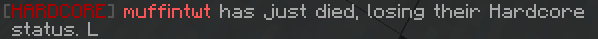

# Cosmetic Hardcore
Adds a cosmetic hardcore mode to your Survival Minecraft server

Download: https://github.com/mufinlive/cosmetic-hardcore/releases

# Features:

## Hardcore status

When a player joins for the first time, they will be assigned the hardcore status. On death, this status is removed, along with a message being sent to chat, notifying everyone that this player has returned to being a normal player.

## Name change

When a player has hardcore status, their name will be light red. This means everyone will be able to see that they have never died before when they speak in chat, for example.

## NBT Data

The plugin stores the hardcore value in the player's NBT data. This can be viewed with `/data get entity <playername>` (The value name is `{"cosmetichardcore:hardcore": "value"}`).

It can be changed with `/sethardcore <player> <true|false>`.